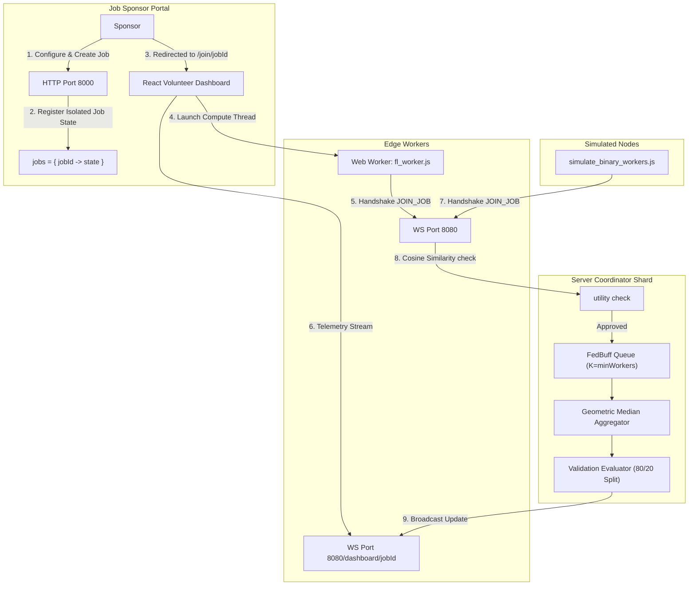

# FedLearn: High-Performance Browser Federated Learning

A highly scalable, production-grade federated learning platform built for the open internet. FedLearn trains machine learning models across thousands of heterogeneous edge devices (browsers, mobile phones, laptops) using pure JavaScript, WebSockets, and ONNX Runtime.

---

## 🌟 Key Features

- **Multi-Tenant Job Isolation:** Deploy and train multiple independent federated models simultaneously. Weight parameters, update buffers, worker registries, early stopping counters, and historical logs are completely isolated per job.
- **Dynamic Job Submission API:** REST endpoints (`POST /job/create`, `GET /job/:id`) allow developers and researchers to configure and launch custom training jobs with distinct hyperparameters on the fly.
- **Zero-Install Browser Compute Volunteering:** Renders a gorgeous, real-time dashboard with a copyable invite link (`/join/<jobId>`). Anyone opening the link instantly launches a background Web Worker that fetches the model, registers to the job, and contributes compute power securely.
- **Browser-Native Edge Compute:** Executes forward passes via `onnxruntime-web` and manual backpropagation entirely inside Web Workers. Zero UI thread blocking.
- **Zero-Copy Binary Protocol:** Uses raw `ArrayBuffer` and `Float32Array` for network transport and memory transfer. Eliminates JSON overhead, reducing tensor serialization latency from ~45ms to <1ms.
- **Asynchronous Aggregation (FedBuff):** Destroys the "straggler bottleneck." The coordinator never waits for slow devices; it aggregates updates dynamically per-job when a buffered threshold ($K$) is reached.
- **FedProx & Local Steps:** Stabilizes training when worker data distributions are heterogeneous (non-IID) by applying local multi-step training along with a proximal loss regularization term ($\mu$).
- **Differential Privacy (DP):** Enforces worker-side **L2 Gradient Clipping** and **Gaussian Noise Injection** to prevent data reconstruction attacks, tracked in real-time by a **Rényi DP (RDP) Accountant**.
- **Bandwidth Compression:** Dramatically reduces network utilization (10–100×) using **Top-K Sparsification** and **INT8 Symmetric Quantization** backed by worker-side **Error Feedback** to prevent convergence loss.
- **Byzantine Fault Tolerance (BFT):** Employs **Weiszfeld's Geometric Median** on the coordinator, robust to a significant fraction of adversarial workers (~30–40% in practice) without stalling aggregation.
- **Anti-Gaming Incentive Firewall:** Measures the cosine similarity of worker updates against the aggregated consensus, automatically rejecting spam, zero-norm, or low-similarity inputs.

---

## 🏗️ Architecture Overview

The system runs on two unified ports (`8000` for REST/Files and `8080` for WebSockets), utilizing isolated job lifecycles:



---

## 🛠️ REST API Endpoints

The server runs a lightweight HTTP router on **Port 8000** to manage jobs:

### 1. Create Training Job
- **Route:** `POST /job/create`
- **Payload:**
  ```json
  {
    "ownerId": "Stanford AI Lab",
    "modelConfig": {
      "minWorkers": 3,
      "fedproxMu": 0.05,
      "dpC": 1.0,
      "dpSigma": 0.2,
      "topK": 0.1,
      "quantize": "int8",
      "localSteps": 3
    }
  }
  ```
- **Response:** `201 Created` returning the job configuration and a unique short `jobId` (e.g. `1b66ea85`).

### 2. Fetch Job Status
- **Route:** `GET /job/:id`
- **Response:** `200 OK` returning real-time status and worker rosters.

### 3. Join Job
- **Route:** `POST /job/join`
- **Response:** `200 OK` adding the worker node to the job roster.

---

## 🚀 Quick Start

### Prerequisites
- Python 3.10+
- Node.js 18+

### Setup and Running

1. **Start the Python Coordinator Server (REST + WebSocket):**
   Installs `websockets` and `numpy`, and starts the server:
   ```bash
   pip install websockets numpy onnx
   python host/server.py
   ```
   - HTTP Server binds to `http://localhost:8000`
   - WebSocket Coordinator binds to `ws://localhost:8080`

2. **Start the React Dashboard Frontend:**
   ```bash
   cd dashboard
   npm install
   npm run dev
   ```
   Open `http://localhost:5173/` in your browser.

3. **Deploy a Federated Session:**
   - On the homepage (`http://localhost:5173/`), customize the hyperparameters (such as Minimum Workers, Proximal term, DP noise, and compression).
   - Click **"Deploy Federated Session"**. This sends a request to the REST API and redirects the browser to the active job dashboard: `http://localhost:5173/join/<jobId>`.

4. **Volunteer Edge Compute:**
   - Share the `/join/<jobId>` link with other devices or open it in a secondary browser window.
   - The browser automatically spins up `/fl_worker.js` as a background Web Worker, downloads the model from Port 8000, connects to Port 8080, and prints live logs inside the terminal frame.

5. **Start a Simulated Worker Fleet:**
   To train immediately with an automated fleet of edge nodes, execute the simulator targeted specifically to your Job ID:
   ```bash
   node worker/simulate_binary_workers.js --workers 3 --job-id <your-job-id> --fedprox-mu 0.05 --local-steps 3 --top-k 0.1 --quantize int8 --dp-c 1.0 --dp-sigma 0.2
   ```

---

## ⚙️ Worker Command-Line Options

| Option | Type | Default | Description |
| :--- | :--- | :--- | :--- |
| `--job-id` | string | *Required* | Target Federated Learning Job ID to register and train |
| `--workers` | number | `3` | Number of simulated concurrent workers to spin up |
| `--fedprox-mu` | float | `0.0` | FedProx proximal coefficient $\mu$ (0.0 = standard FedAvg) |
| `--local-steps`| number | `1` | Local training iterations per batch before computing gradient delta |
| `--dp-c` | float | `0.0` | Differential Privacy L2 clipping bound $C$ (0.0 = disabled) |
| `--dp-sigma` | float | `0.0` | Differential Privacy Gaussian noise standard deviation $\sigma$ (0.0 = disabled) |
| `--top-k` | float | `0.0` | Sparsification fraction (e.g. `0.05` for top 5%, 0.0 = disabled) |
| `--quantize` | string | `none` | Quantization mode (`none`, `int8`) |

---

## 🛡️ Security & Privacy Guidelines

- **Zero-Trust Client Compute:** No raw datasets or personal data items are ever uploaded.
- **DP-First Sequence Execution:** Differential Privacy clipping and noise addition occur **BEFORE** gradient compression. Adding DP noise *after* sparsification on the host or worker leaks private index selection details; performing DP noise injection first guarantees mathematically robust privacy preservation via the Post-Processing Theorem.
- **Anti-Gaming Firewall:** A robust cosine similarity utility check runs on the coordinator server to automatically filter and reject trivial gradients, poisoning attempts, or malicious uploads.
- **Weiszfeld Geometric Median:** Ensures BFT aggregation that remains robust against up to 49% adversarial workers.
